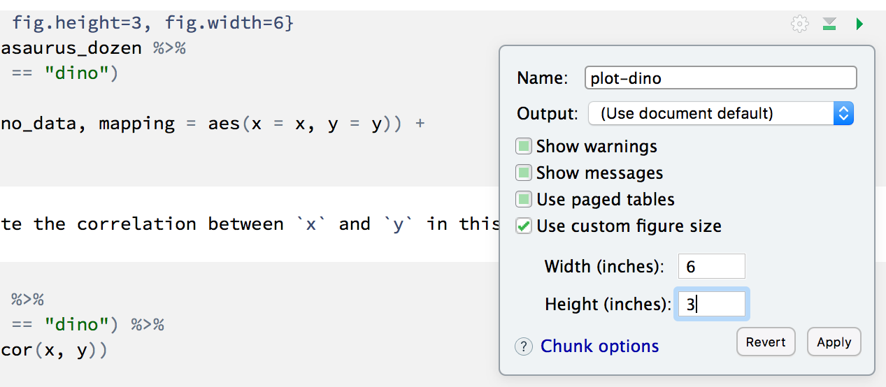

```{r setup, include=FALSE}
knitr::opts_chunk$set(echo = TRUE, eval = FALSE)
```

# Learning goals

- Get acquainted with R and RStudio, which we will be using throughout the course to analyze data as well as to learn the statistical concepts discussed in the course. 
- Appreciate the value of visualization in exploring the relationship between variables.
- Start using R for building plots and calculating summary statistics.

# Terminology

We've already thrown around a few new terms, so let's define them before we proceed.

- **R**: Name of the programming language we will be using throughout the course.
- **RStudio**: An integrated development environment for R. In other words, a convenient interface for writing and running R code.

I like to think of R as the engine of the car, and RStudio is the dashboard.

# Starting slow

As the labs progress, you are encouraged to explore beyond what the labs dictate; a willingness to experiment will make you a much better programmer. Before we get to that stage, however, you need to build some basic fluency in R. Today we begin with the fundamental building blocks of R and RStudio: the interface, reading in data, and basic commands.

And to make versioning simpler, this is a solo lab. Additionally, we want to make sure everyone gets a significant amount of time at the steering wheel.

# Getting started

## Download R

### If you don't have R installed.

Go to the [CRAN](https://cran.r-project.org/) and download R, make sure you get the version that matches your operating system.

### If you have R installed

If you have R installed run the following code

```{r, eval=TRUE}
R.version
```

This should tell you what version of R you are currently using. If your R version is lower then 3.6.0 I would strongly recommend updating. In general it is a good idea to update your R version, unless you have a project right now that depend on a specific version of R.

## Download RStudio

We recommend using RStudio as your IDE if you don't already have it installed. You can go to the [RStudio](https://rstudio.com/products/rstudio/download/) website to download and install the software.

## Launch RStudio

You can also open the RStudio application first and then create a project by going `file -> new project...`

## Create a new Rmarkdown file

`file -> new file -> R markdown...`

# Hello RStudio!

RStudio is comprised of four panes.

- On the bottom left is the Console, this is where you can write code that will be evaluated. Try typing `2 + 2` here and hit enter, what do you get?

- On the bottom right is the Files pane, as well as other panes that will come handy as we start our analysis.

- If you click on a file, it will open in the editor, on the top left pane.

- Finally, the top right pane shows your Environment. If you define a variable it would show up there. Try typing `x <- 2` in the Console and hit enter, what do you get in the Environment pane?

# Packages

R is an open-source language, and developers contribute functionality to R via packages. In this lab we will work with three packages: `palmerpenguins` which contains the dataset, and `tidyverse` which is a collection of packages for doing data analysis in a "tidy" way.

Load these packages by running the following in the Console.

```{r message=FALSE}
library(tidyverse)
library(tidymodels)
library(palmerpenguins)
```

If you haven't installed these packages yet and R complains, then you can install these packages by running the following command. (Note that R package names are case-sensitive)

```{r, eval = FALSE}
install.packages(c("tidyverse", "palmerpenguins"))
```

Note that the packages are also loaded with the same commands in your R Markdown document.

# Warm up

Before we introduce the data, let's warm up with some simple exercises.

The top portion of your R Markdown file (between the three dashed lines) is called YAML. It stands for "YAML Ain't Markup Language". It is a human friendly data serialization standard for all programming languages. All you need to know is that this area is called the YAML (we will refer to it as such) and that it contains meta information about your document.

## YAML

Open the R Markdown (Rmd) file in your project, change the author name to your name, and knit the document.

# Data

The data frame we will be working with today is called `penguins` and it's in the `palmerpenguins` package. 

```{r}
library(tidyverse)
library(tidymodels)
library(palmerpenguins)

penguins
```

count the number of `species` and `island`s with `dplyr::count()`

Visualize the distribution of `body_mass_g` with ggplot

```{r}
ggplot(penguins, aes(body_mass_g)) +
  geom_histogram()
```

Look at the correlation between `body_mass_g` and some of the other variables

```{r}
ggplot(penguins, aes(body_mass_g, ___)) +
  geom_point()
```

# Modeling

Fit a linear model using `parsnip` to model `body_mass_g`

```{r}
lm_spec <- linear_reg() %>%
  set_engine("lm")

lm_fit <- lm_spec %>%
  fit(___ ~ species + island + bill_length_mm + bill_depth_mm + flipper_length_mm, 
      data = penguins)

lm_fit
```

Get parameter estimates:

```{r}
tidy(lm_fit)
```

# Figures

You're done with the data analysis exercises, but we'd like you to do two more things:


- **Resize your figures:** 

Click on the gear icon in on top of the R Markdown document, and select "Output Options..." in the dropdown menu. In the pop up dialogue box go to the Figures tab and change the height and width of the figures, and hit OK when done. Then, knit your document and see how you like the new sizes. Change and knit again and again until you're happy with the figure sizes. Note that these values get saved in the YAML.



You can also use different figure sizes for different figures. To do so click on the gear icon within the chunk where you want to make a change. Changing the figure sizes added new options to these chunks: `fig.width` and `fig.height`. You can change them by defining different values directly in your R Markdown document as well.


- **Change the look of your report:** 

Once again click on the gear icon in on top of the R Markdown document, and select "Output Options..." in the dropdown menu. In the General tab of the pop up dialogue box try out different syntax highlighting and theme options. Hit OK and knit your document to see how it looks. Play around with these until you're happy with the look.

# Optional

If you have time you can explore the different ways you can add styling to your rmarkdown document.

Here is a [cheatsheet](https://rstudio.com/wp-content/uploads/2015/02/rmarkdown-cheatsheet.pdf)

and a [markdown cheatsheet](https://www.markdownguide.org/cheat-sheet/)

---

This set of lab exersixes have been adopted from [Mine Çetinkaya-Rundel](https://twitter.com/minebocek)'s class [Introduction to Data Science](https://github.com/ids-s1-19).
