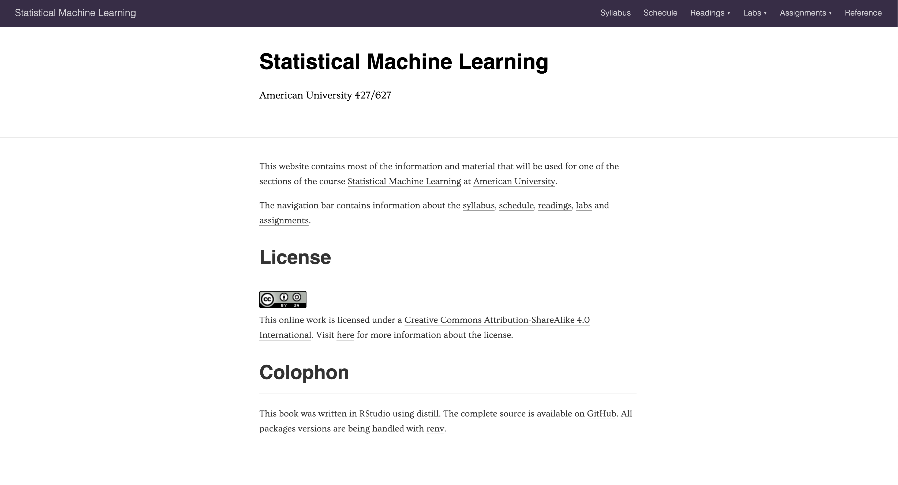
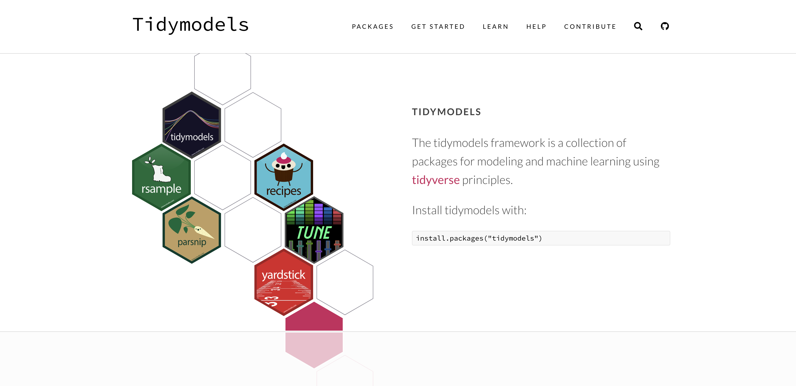

```{r include=FALSE}
library(knitr)
hook_output <- knit_hooks$get("output")
knit_hooks$set(output = function(x, options) {
  lines <- options$output.lines
  if (is.null(lines)) {
    return(hook_output(x, options))  # pass to default hook
  }
  x <- unlist(strsplit(x, "\n"))
  more <- "..."
  if (length(lines) == 1) {        # first n lines
    if (length(x) > lines) {
      # truncate the output, but add ....
      x <- c(head(x, lines), more)
    }
  } else {
    x <- c(more, x[lines], more)
  }
  # paste these lines together
  x <- paste(c(x, ""), collapse = "\n")
  hook_output(x, options)
})
knit_hooks$set(output = function(x, options) {
  # this hook is used only when the linewidth option is not NULL
  if (!is.null(n <- options$linewidth)) {
    x = knitr:::split_lines(x)
    # any lines wider than n should be wrapped
    if (any(nchar(x) > n)) x = strwrap(x, width = n)
    x = paste(x, collapse = '\n')
  }
  hook_output(x, options)
})

opts_chunk$set(
  echo = TRUE,
  fig.width = 7, 
  fig.align = 'center',
  fig.asp = 0.618, # 1 / phi
  out.width = "700px")
```

```{r, echo = FALSE}
library(sass)
sass(sass_file("theme.sass"), output = "theme.css")
```

# Welcome

--

- Introductions
- Syllabus
- Material
- Questions

---

# Questions

You are encouraged to ask questions when you have them rather than wait for me to ask for questions. If you have a question, chances are that something else has a question.

---

# Attendence and Camera

Both highly encouraged

Due to COVID-19 both should be practiced according to what makes you safe

---

# About Me

- Data Analyst at Teladoc Health
- R package developer, about 10 packages on CRAN (textrecipes, themis, paletteer, prismatic, textdata)
- Co-author of "Supervised Machine Learning for Text Analysis in R" to be published soon

---



???

https://emilhvitfeldt.github.io/AU-2021spring-627/index.html

---

# Syllabus

---

## An Introduction to Statistical Learning with Applications in R

Will be our main textbook

We will cover most of the material, and follow it mostly chronological

---

## The Elements of Statistical Learning: Data Mining, Inference, and Prediction

Supplementary textbook

I Will sometimes refer to this book when more detail is needed

---

## Tidy Modeling with R

New (work in progress)

I Will sometimes refer to this book when more detail is needed

---

## Syllabus

Come to me before it is too late

I'm here to help, my main goal for this course is to make you succeed

---

# Late assignment

There are some (limited) late penalties

It is more important for me that you turn something in then that you give up. You will always get points (sometimes reduced) for late assignments

Contact me if you are having a hard time or need to turn in late

---

# Lecture

40 + 15 + 40 + 15 + 40

Focused on intuition, concepts, and statistics

---

# Labs

A hands-on section where we work together on the implementation side in R

These should be turned in WITH explanatory text.

---

# Assignments

There will be 10 assignments

It Will contain a mix of conceptual questions and practical coding exercises about the weekly topic

---

# Midterm

We will have a midterm halfway through the course

Will be a multi-day "take-home" test

The Midterm will cover multiple weeks of material

---

# Final Project

We end the class with a final machine learning project

You will find a data set and analyze it with the tools you have learned in the class

The project will be a document(20%) and a presentation given to the class(5%)

Data will have to be approved by me

---



---

# tidymodels feedback

Any and all feedback regarding the use of {tidymodels} is appreciated

Both how I am teaching it and how it is to use

---

# Slack

Discussion place and questions

---

# Material 1/2

1. Introduction, motivation, and examples. Understanding large and complex data sets. Statistical
learning. First steps in R. [Chap. 1-2].
2. Review of regression modeling and analysis; implementation in R. [Chap. 3].
3. Classification problems and classification tools. Logistic regression and review of linear discriminant
analysis. [Chap. 4]
4. Resampling methods; bootstrap. [Chap. 5 and lecture notes].

---

# Material 2/2

5. High-dimensional data and shrinkage. Ridge regression. LASSO. Model selection methods and
dimension reduction. Principal components. Partial least squares. [Chap. 6]
6. Nonlinear trends and splines. [Chap. 7; 7.4-7.5]
7. Regression trees and decision trees [Chap. 8]
8. Introduction to support vector machines [Chap. 9]
9. Clustering methods [Chap. 10]
10. Additional topics and applications, if time permits.

---

.pull-left[
## What you will learn

- How the foundational Machine learning models work
- The intuition behind them
- How to use them
- Using {tidymodels}
]

.pull-right[
## What you won't

- How they are coded
- State of the art (SOTA) methods
]

---

# Questions?
